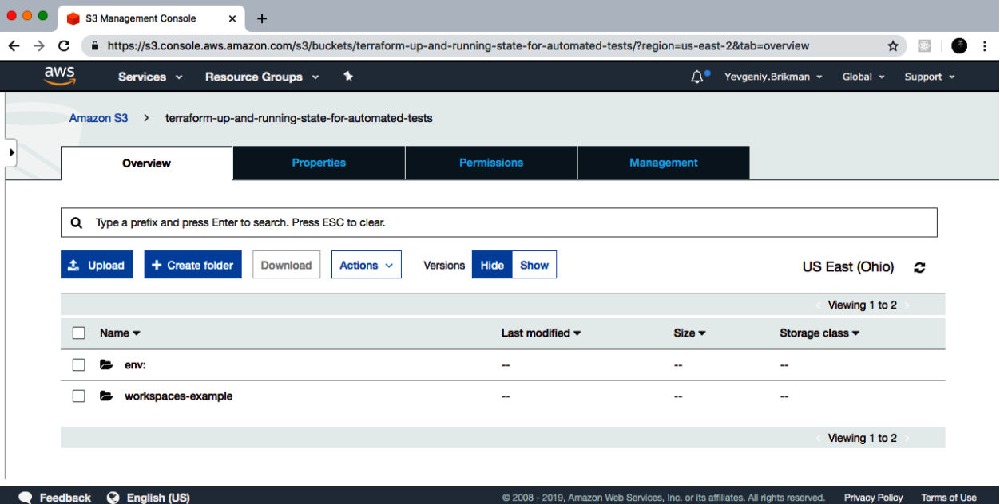
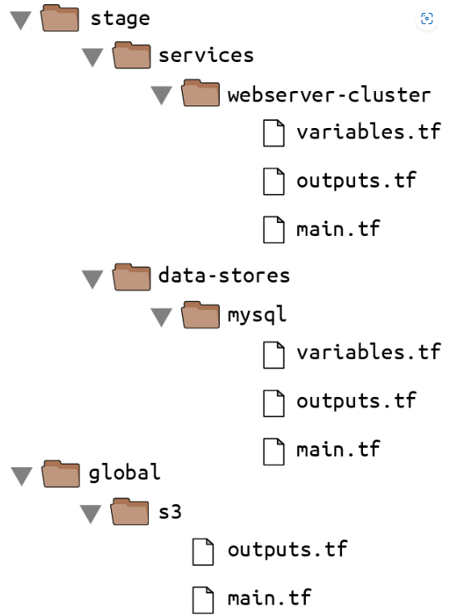
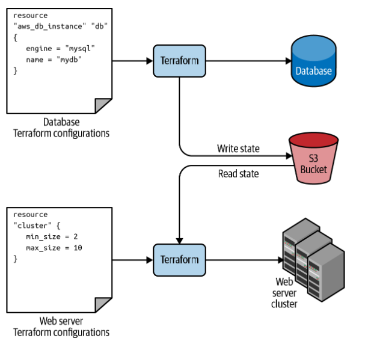

# 테라폼 상태 관리하기
## 배경
테라폼을 사용하면서 추가 인프라를 구성할 때 테라폼이 현재 리소스 상태를 자동으로 확인해주는 것을 볼 수 있었습니다. 어떻게 테라폼은 현 상태를 자동으로 확인하고 이 기반으로 새로운 인프라 리소스를 추가하는지 알아봅시다. 
이 챕터에서는 테라폼이 인프라의 상태를 어떻게 추적하는지 하단을 통해 알아봅니다.

* 테라폼 상태란?
* 상태 파일을 위한 공유 저장소
* 테라폼 백앤드의 제한들
* 상태 파일 격리
- 작업 공간을 통한 격리
- 파일 레이아웃을 통한 격리
* tereraform_remote_state 데이터 소스

## 테라폼 상태란?
테라폼을 실행 시킬 때 마다 테라폼은 테라폼의 인프라 리소스를 JSON 형태로 매핑하여 테라폼 상태 파일(.tfstate)에 저장합니다.
<pre>resource "aws_instance" "example" { 
  ami           = "ami-0fb653ca2d3203ac1" 
  instance_type = "t2.micro" 
}</pre>

위의 테라폼 구성을 terraform apply 하면 상태 파일에 하단 같이 저장됩니다.'
<pre>{ 
  "version": 4, 
  "terraform_version": "1.2.3", 
  "serial": 1, 
  "lineage": "86545604-7463-4aa5-e9e8-a2a221de98d2", 
  "outputs": {}, 
  "resources": [ 
    { 
      "mode": "managed", 
      "type": "aws_instance", 
      "name": "example", 
      "provider": "provider[\"registry.terraform.io/hashicorp/aws\"]", 
      "instances": [ 
        { 
          "schema_version": 1, 
          "attributes": { 
            "ami": "ami-0fb653ca2d3203ac1", 
            "availability_zone": "us-east-2b", 
            "id": "i-0bc4bbe5b84387543", 
            "instance_state": "running", 
            "instance_type": "t2.micro", 
            "(...)": "(truncated)" 
          } 
        } 
      ] 
    } 
  ] 
}</pre>

테라폼을 실행시킬 때마다 테라폼은 위의 상태 파일을 참조하여 어떤 부분이 변경 되어야 하는 지를 파악합니다.

단일의 테라폼 상태 파일은 개인 프로젝트를 진행할 때 문제가 없지만, 팀 적으로 프로젝트를 진행할 때 문제를 일으킬 수 있습니다.

상태 파일을 위한 공유 저장소
테라폼을 활용하여 인프라를 업데이트 해야 할 때, 각자의 팀 맴버들이 같은 상태 파일을 참조해야 합니다. 이는 테라폼 상태 파일을 공유 저장소에 저장 해야 함을 뜻합니다.

상태 파일 잠그기
다수의 팀 멤버가 테라폼을 같은 때에 실행을 하게 되면 프로세스가 동시에 진행되기 때문에 충돌이 일어날 수 있습니다. 이를 방지하기 위해 상태 파일을 잠가야 합니다.

상태 파일 격리 시키기
인프라 변경을 할 때에는 다른 환경들을 서로 격리 시켜줘야 합니다. 예를 들어 테스트 환경의 테라폼 구성이 운영 환경에 영향을 주지 않아야 합니다. 이를 위하여 각각의 환경에 상태 파일을 격리 시켜줘야 합니다.

이 문제들을 어떻게 해결할지 알아봅시다.

## 상태 파일을 위한 공유 저장소
많은 팀들이 협업을 하기 위해 깃을 사용합니다. 테라폼 코드를 깃을 활용하여 협업하는 것은 좋은 방법이지만 테라폼 상태 파일을 깃에 올려 사용하는 것은 옳지 못 한 방법입니다. 아래는 이유들을 설명합니다.
*수동 오류*
최신 상태의 버전을 다운 받아 테라폼 실행 후 업데이트 된 상태 파일을 다시 깃에 올리는 수동 절차가 항상 잘 이뤄질 수는 없습니다. 

*잠그기*
대부분의 버전 컨트롤 도구들은 두 명 이상의 사용자가 terraform apply를 동시에 하는 것을 막아주지 않습니다.

*보안유지*
테라폼 상태 파일은 텍스트 파일로 형성 됩니다. 테라폼 리소스는 보안 데이터를 포함할 수 있어 보안 데이터를 포함한 텍스트 파일을 깃과 같은 공유 저장소에 올려 놓는 것은 보안유지에 방해가 될 수 있습니다.

버전컨트롤 툴을 사용하는 대신에 테라폼의 원격 백엔드를 활용하여 상태 파일을 관리하는 방법이 있습니다. 원격 백엔드는 상태 파일을 S3 혹은 GCS와 같은 클라우드 저장소에 원격으로 관리할 수 있게 해줍니다.

원격 저장소는 위의 이슈들을 해결해줍니다.

수동 오류
원격 백엔드를 구성하면 테라폼이 자동으로 상태 파일을 plan 이나 apply를 할 때마다 원격 백엔드에 저장합니다. 이로 인하여 수동 오류를 방지할 수 있습니다.

잠그기
대부분의 원격 백엔드는 선천적으로 잠그는 기능을 제공한다. 한 유저가 apply를 하면 테라폼은 잠기는 상태가 되어 다른 유저가 apply를 하면 적용되지 않는다.

보안유지
대부분의 원격 백엔드는 암호화 기능을 제공한다. 텍스트 형식의 상태파일들이 암호화가 되어 저장되면 보안을 유지할 수 있다.

만약 AWS 유저라면 S3를 원격 백엔드로 사용하는 것이 제일 좋은 방법이다.
* S3는 AWS로 인해 관리되는 서비스라 추가 인프라 구축을 할 필요가 없다
* 데이터 손실을 걱정할 필요가 없다
* 암호화를 지원하기 때문에 보안 데이터를 보호할 수 있다
* 잠금 기능을 제공한다
* 버전컨트롤이 가능하다
* 싸다!

S3를 원격 상태 저장소로 활용하려면 S3 버킷을 생성해야한다. 새로운 main.tf 파일을 만들어 하단과 같이 구성해준다.

<pre>provider "aws" { 
  region = "us-east-2" 
}</pre>

다음으로 버킷을 만들어 준다.
<pre>resource "aws_s3_bucket" "terraform_state" { 
  bucket = "terraform-up-and-running-state" 
 
  # Prevent accidental deletion of this S3 bucket 
  lifecycle { 
    prevent_destroy = true 
  } 
}</pre>
위의 코드는 버킷의 이름을 설정해주고 버킷이 실수로 삭제되는 것을 방지해준다.

다음으로 이 버킷을 보호하기 위해 추가 레이어들을 설정해봅시다.
버킷 버저닝을 설정하여 버전컨트롤이 가능하게 합니다.
<pre>resource "aws_s3_bucket_versioning" "enabled" { 
  bucket = aws_s3_bucket.terraform_state.id 
  versioning_configuration { 
    status = "Enabled" 
  } 
}</pre>
다음으로 암호화를 설정해주어 상태 파일이 디스크에 암호화 되도록 설정해줍니다.
<pre>resource 
"aws_s3_bucket_server_side_encryption_configuration" "default" { 
  bucket = aws_s3_bucket.terraform_state.id 
 
  rule { 
    apply_server_side_encryption_by_default { 
      sse_algorithm = "AES256" 
    } 
  } 
}</pre>

버킷은 기본적으로 private이지만 팀원들이 public하게 만들 수 있는 부분을 방지해줍니다.
</pre>resource "aws_s3_bucket_public_access_block" "public_access" { 
  bucket                  = aws_s3_bucket.terraform_state.id 
  block_public_acls       = true 
  block_public_policy     = true 
  ignore_public_acls      = true 
  restrict_public_buckets = true 
}</pre>

다음으로 DynamoDB를 생성하여 잠금이 되도록 설정해줍니다. 이를 위하여 테이블에 LockID 라는 기본 키를 설정해줍니다.
</pre>resource "aws_dynamodb_table" "terraform_locks" { 
  name         = "terraform-up-and-running-locks" 
  billing_mode = "PAY_PER_REQUEST" 
  hash_key     = "LockID" 
 
  attribute { 
    name = "LockID" 
    type = "S" 
  } 
}</pre>

terraform init 을 실행하여 제공자 코드를 다운받고 terraform apply 를 실행하여 배포해줍니다. S3 버킷과 DynamoDB 테이블이 생성된 것을 확인할 수 있습니다. 하지만 아직 상태 파일이 로컬에 저장되기 때문에 버킷에 저장되게 하기 위해서는 하단처럼 백엔드 구성을 테라폼 코드에 추가해줘야 합니다. 
<pre>terraform { 
  backend "s3" { 
    # Replace this with your bucket name! 
    bucket         = "terraform-up-and-running-state" 
    key            = "global/s3/terraform.tfstate" 
    region         = "us-east-2" 
 
    dynamodb_table = "terraform-up-and-running-locks" 
    encrypt        = true 
  } 
}</pre>
bucket은 버킷 이름입니다. key에는 버킷 내 상태 파일이 저장되어야 하는 파일주소를 입력해줍니다. region에는 버킷이 생성되는 region 값을 입력해줍니다. dynamodb_table에는 테이블 이름을 입력해줍니다. ecrypt를 true로 설정해 디스크에 상태파일이 암호화가 될 수 있게 해줍니다.

이렇게 설정된 것을 적용시키기 위해선 다시 한번 terraform init 을 실행시켜줍니다. 테라폼은 이미 유저가 상태파일을 갖고 있는 것을 확인하고 이를 s3 백엔드에 복사할 것인지를 묻습니다. yes라 답해줍니다. 이제 테라폼의 상태는 s3 버킷에 저장됩니다. 이제 테라폼을 실행할 때 마다 자동으로 최신 상태를 S3에서 가저오고 추가된 최신 상태를 업데이트 해줍니다. 이 절차를 확인하기 위해 하단 출력변수들을 만들어 줍시다.
<pre>output "s3_bucket_arn" { 
  value       = aws_s3_bucket.terraform_state.arn 
  description = "The ARN of the S3 bucket" 
} 
 
output "dynamodb_table_name" { 
  value       = aws_dynamodb_table.terraform_locks.name 
  description = "The name of the DynamoDB table" 
}</pre>

terraform apply를 하면 s3와 dynamodb의 arn들을 출력해줍니다.

이 절차들이 다 실행되었다면 테라폼은 이제 자동으로 s3 버킷에서 상태 파일을 불러오고 업데이트된 최신 상태를 업로드 해줍니다.

## 테라폼 백엔드의 제한들
첫 번째 제한은 테라폼의 원격 백엔드를 설정하고 난 후 이를 제거하기 위해서는 위의 절차들을 반대로 거쳐야 한다는 점입니다. 백엔드 구성 코드를 테라폼에서 지우고 terraform init 을 실행 후 S3 와 DynamoDB를 지우는 terraform destroy 를 실행해야 합니다.

두 번째 제한은 테라폼 내 백엔드를 구성하는 코드들은 변수를 사용할 수 없습니다. 모듈을 생성하거나 키 값, 버킷, 그리고 테이블 이름들을 수동으로 복사하고 붙여 넣어야 하는 단점이 있습니다. 이 단점을 개선 시키는 방법은 키 값을 잘 부여하여 부분 구성 파일을 작성하는 것입니다. backend.hcl 파일을 하단 처럼 생성합니다.
<pre># backend.hcl 
bucket         = "terraform-up-and-running-state" 
region         = "us-east-2" 
dynamodb_table = "terraform-up-and-running-locks" 
encrypt        = true</pre>
그리고 하단 처럼 버킷 리소스를 구성합니다.
<pre>terraform { 
  backend "s3" { 
    key = "example/terraform.tfstate" 
  } 
}</pre

부분 구성 파일을 적용 시키려면 하단 init 코드를 실행합니다.
<pre>$ terraform init -backend-config=backend.hcl</pre>
위의 부분 구성 파일은 어떤 모듈에도 사용이 될 수 있어 반복 적인 수동 작업을 줄여줍니다.

## 상태 파일 격리
테라폼의 상태파일을 하나의 파일로 관리하게 된다면 오류가 생겼을 때 이를 참조하는 모든 환경에 영향을 끼칠 수가 있습니다. 이를 방지하기 위해서는 상태 파일을 각각의 환경 마다 격리를 해야합니다. 상태 파일을 격리할 수 있는 두가지 방법이 있습니다.

작업 공간을 통한 격리
동일한 구성을 빠르게 테스트 할 때 유용합니다.

파일 레이아웃을 통한 격리
운영 환경으로 부터 분리가 필요할 때 유용합니다.

좀 더 자세한 부분을 살펴봅시다.

### 작업공간을 통한 격리
테라폼은 기본 작업공간으로 부터 시작됩니다. 하지만 하단 코드를 사용하면 새로운 작업공간을 생성할 수 있습니다.

<pre>terraform workspace new <workspace name></pre>
실험을 통해 알아봅시다. 우선 기본 작업공간에 EC2 인스턴스를 생성해 주고 원격 백엔드를 구성해줍니다.

<pre>resource "aws_instance" "example" { 
  ami           = "ami-0fb653ca2d3203ac1" 
  instance_type = "t2.micro" 
}</pre>

<pre>terraform { 
  backend "s3" { 
    # Replace this with your bucket name! 
    bucket         = "terraform-up-and-running-state" 
    key            = "workspaces-example/terraform.tfstate" 
    region         = "us-east-2" 
 
    # Replace this with your DynamoDB table name! 
    dynamodb_table = "terraform-up-and-running-locks" 
    encrypt        = true 
  } 
}</pre>

하단의 코드를 통해 기본 작업공간이 생긴것을 확인할 수 있습니다.
<pre>$ terraform workspace show 
default</pre>

다음, 위의 처음 코드를 사용하여 새로운 작업공간을 생성해줍니다. 똑같이 EC2 인스턴스와 원격 백엔드를 구성해주고 하단 코드를 사용하여 현재 작업공간들의 리스트를 출력합니다.

<pre>$ terraform workspace list 
  default 
  example1 
* example2</pre>

생성된 작업공간들을 확인할 수 있습니다. 하단 코드를 통해서 원하는 작업공간으로 이동할 수 있습니다.
<pre>$ terraform workspace select example1 
Switched to workspace "example1".</pre>

S3 콘솔에 들어가면 해당 작업공간들이 생성된 것을 확인할 수 있습니다. 

각 작업 공간 내에서 테라폼은 백엔드 구성에서 지정한 키를 사용하므로 example1/workspaces-example/terraform.tfstate 및 example2/workspaces-example/terraform.tfstate를 찾아야 합니다. 즉, 다른 작업 공간으로 전환하는 것은 상태 파일이 저장된 경로를 변경하는 것과 같습니다.

하단 코드를 활용해서 각 작업공간마다 다른 EC2 인스턴스 타입을 설정해줄 수 있습니다. 
<pre>resource "aws_instance" "example" { 
  ami           = "ami-0fb653ca2d3203ac1" 
  instance_type = terraform.workspace == "default" ? "t2.medium" : "t2.micro" 
}</pre>

작업공간을 격리하여 테라폼 상태파일을 관리하는 것은 위와같은 장점들이 있지만 아래와 같은 단점들로 인하여 이 방법이 상태 파일을 관리하는데에 최적화된 방법이 아닐 수도 있습니다.
* 작업공간들의 테라폼 상태 파일은 같은 원격 백엔드에 저장됩니다. 이는 같은 인증키를 사용한다는 단점이 있습니다. 같은 인증키를 사용하면 환경들 끼리 격리 시킬수가 없습니다
* 작업공간들을 시각적으로 보기가 어렵습니다. 이는 관리하는 데에 어려움을 초래할 수 있습니다
* 다양한 작업공간들을 같은 인증키를 통해 관리하는 데에 있어서 사용자 오류들을 초래할 수 있습니다. 예를 들어, 테스트 작업공간의 테라폼 코드를 운영 작업공간에 실수로 배포 할 수 있습니다
위와같은 단점으로 인하여 작업공간으로 테라폼의 상태파일을 격리하는 부분은 환경을 분리하는데에 적합한 방법이 아닐 수가 있습니다. 이를 보완하기 위하여 파일 레이아웃을 통한 격리하는 방법을 살펴봅시다. 

### 파일 레이아웃을 통한 격리
환경들 사이에서 각각의 테라폼 상태 파일들을 완전한 격리를 하기 위해서는 다음을 시행해야 합니다.
* 각각의 환경에 대한 테라폼 구성 파일들을 각자의 폴더에 생성합니다
* 서로 다른 인증 메카니즘과 접근 컨트롤을 활용하여 각각의 환경에 다른 백엔드를 구성합니다 (서로 다른 AWS 계정 사용 등)
더 나아가 테라폼 상태 파일을 관리를 환경 단에서 하는 것보다 컴포넌트 단에서 하는 것을 추천합니다. 예를들어 VPC 컴포넌트와 웹서버를 컴포넌트 관련 테라폼 구성들을 한 테라폼 파일에 구성하는 것은 한 컴포넌트에 대해 작업을 할 때 다른 컴포넌트가 잘못 된 영향을 끼칠 수 있는 위험이 있기 때문입니다. 그러므로 다른 환경 내에서도 각자의 컴포넌트 별로 테라폼 폴더를 생성하여 아래와 같이 관리하는 것을 추천합니다. 

위의 구조를 살펴봅시다.
상위 레벨에는 환경 단위로 폴더들이 분리되어있습니다. 예를 들어봅시다.
stage: 테스트 환경
prod: 운영 환경
mgmt: 데브옵스 환경
global: 모든 환경에 사용 될 수 있는 리소스를 구축하는 환경

위의 각 환경 내에서 컴포넌트 단계로 폴더를 구성할 수 있습니다. 예를 들어봅시다.
vpc: 해당 환경의 네트워크 컴포넌트
services: 어플리케이션이나 마이크로 서비스와 같이 해당 환경을 실행할 수 있는 컴포넌트
data-storage: 해당 환경의 데이터 저장소 컴포넌트

위의 각각의 컴포넌트 내에 테라폼 구성 파일들이 다음과 같이 체계화 될 수 있습니다.
variables.tf: 입력변수
outputs.tf: 출력변수
main.tf: 리소스와 데이터 소스

위와 같이 말고도 다른 방법으로도 체계화 할 수 있습니다.
dependencies.tf: 외부 요소에 의존하는 데이터 소스를 포함합니다
providers.tf: 클라우드 제공자 및 인증 관련 코드들을 포함합니다
main-xxx.tf: 리소스를 관리하는 코드들을 포함합니다. 많은 리소스를 관리될 수 있기 때문에 경우에 따라 더 세부적으로 나누어 관리할 수 있습니다 (main-s3.tf, main-iam.tf).

이와 같이 파일 레이아웃 형식으로 테라폼 상태 파일을 관리하면 장점이 있습니다.
*알아보기 쉬운 코드와 환경 레이아웃*
* 코드들을 찾기 쉽고 각각의 환경에 어떤 컴포넌트들이 배포되었는지 쉽게 알 수 있습니다
*격리*
* 환경들이 서로 격리가 될 수 있고 더 나아가 환경 내 컴포넌트들끼리도 격리될 수 있습니다. 이에 따라 실수로 테라폼 상태 파일들을 잘 못 구성하면 오류 확산이 컴포넌트 내로 제한됩니다

하지만 단점들도 당연히 있는데요.
*다수의 폴더에서 작업을 해야합니다*
* terraform apply 실행 작업을 각각의 폴더 내에서 해야한다는 단점이 있습니다
- Terragrunt 를 활용하면 이를 보완할 수 있습니다
*복사/붙여넣기를 해야합니다*
* 파일 레이아웃들이 다양해 지면서 중복되는 코드들이 있습니다
- 테라폼 모듈을 활용하면 중복 코드를 줄일 수 있습니다
*리소스 의존성 활용이 떨어질 수 있습니다*
* 앱 구성 코드와 데이터베이스 구성 코드가 같은 레이어에 있으면 변수를 활용하여 서로 관련된 속성들을 참조할 수 있지만 다른 레이어에 있으면 변수를 활용해 참조가 불가하여 리소스 의존성이 떨어집니다.

### terraform_remote_state 데이터 소스
챕터 2에서 aws_subnets 데이터 소스를 활용하여 AWS에서 VPC 내의 subnet 리스트를 입력 받았습니다. 같은 방식으로 terraform_remote_state 데이터 소스를 생성하여 다른 테라폼 구성에 의해 저장된 테라폼 상태 파일데이터를 가져올 수 있습니다.

예를 들어봅시다. 웹서버 클러스터가 MySQL 데이터베이스와 통신을 해야한다고 합시다. 이를 위해서 같은 구성 파일에 데이터베이스와 웹서버를 정의하는 것은 좋지 않은 방법입니다. 웹서버 클러스터를 업데이트 할 경우가 많을 텐데 그럴 때 마다 데이터베이스 구성을 고장낼 위험이 있기 때문입니다. 

이를 방지하기 위해서 하단과 같이 테라폼 파일들을 체계화 해봅니다.

다음으로 데이터베이스 리소스를 이 주소에 생성해줍니다
#### stage/data-stores/mysql/main.tf
<pre>provider "aws" { 
  region = "us-east-2" 
} 
 
resource "aws_db_instance" "example" { 
  identifier_prefix   = "terraform-up-and-running" 
  engine              = "mysql" 
  allocated_storage   = 10 
  instance_class      = "db.t2.micro" 
  skip_final_snapshot = true 
  db_name             = "example_database" 
 
  username = var.db_username 
  password = var.db_password 
}</pre>

위의 코드에 데이터베이스의 사용자 이름과 비밀번호를 설정해줘야 하는데요, 이를 위해 변수들을 하단 같이 이 주소에 생성해줍니다.
#### stage/data-stores/mysql/variables.tf
<pre>variable "db_username" { 
  description = "The username for the database" 
  type        = string 
  sensitive   = true 
} 
 
variable "db_password" { 
  description = "The password for the database" 
  type        = string 
  sensitive   = true 
}</pre>

다음으로, 이 상태를 s3에 저장하기 위해 원격 백엔드를 구성해줍니다. 
<pre>terraform { 
  backend "s3" { 
    # Replace this with your bucket name! 
    bucket         = "terraform-up-and-running-state" 
    key            = "stage/data-stores/mysql/terraform.tfstate" 
    region         = "us-east-2" 
 
    # Replace this with your DynamoDB table name! 
    dynamodb_table = "terraform-up-and-running-locks" 
    encrypt        = true 
  } 
}</pre>

마지막으로 이 주소에 출력변수를 추가하여 데이터베이스의 주소값과 포트값을 받아올 수 있도록 설정해줍니다.
#### stage/data-stores/mysql/outputs.tf 
<pre>output "address" { 
  value       = aws_db_instance.example.address 
  description = "Connect to the database at this endpoint" 
} 
 
output "port" { 
  value       = aws_db_instance.example.port 
  description = "The port the database is listening on" 
}</pre>

데이터베이스의 사용자 이름과 비밀번호를 입력해줄 수 있는 환경변수를 만들어줍니다.
<pre> export TF_VAR_db_username="(YOUR_DB_USERNAME)" 
export TF_VAR_db_password="(YOUR_DB_PASSWORD)"</pre>

terraform init 과 terraform apply를 실행하면 하단과 같이 출력됩니다.
<pre>$ terraform apply 
(...) 
Apply complete! Resources: 1 added, 0 changed, 0 destroyed. 
Outputs: 
address = "terraform-up-and-running.cowu6mts6srx.us-east-2.rds.amazonaws.com" 
port = 3306</pre>
이 출력값들은 stage/data-stores/mysql/terraform.tfstate 이 주소에 있는 s3 버킷에 저장이 되며, 이 값들은 웹서버에서 출력변수들을 stage/services/webserver-cluster/main.tf 주소의 terraform_remote_state 데이터 소스를 통해 읽어올 수 있습니다.
<pre>data "terraform_remote_state" "db" { 
  backend = "s3" 
 
  config = { 
    bucket = "(YOUR_BUCKET_NAME)" 
    key    = "stage/data-stores/mysql/terraform.tfstate" 
    region = "us-east-2" 
  } 
}</pre>
이 terraform_remote_state 데이터 소스는 데이터베이스가 상태를 저장하는 동일한 S3 버킷 및 폴더에서 상태 파일을 읽도록 웹 서버 클러스터 코드를 구성합니다.

모든 테라폼 데이터 소스와 마찬가지로 terraform_remote_state에서 반환된 데이터는 읽기 전용임을 이해하는 것이 중요합니다.
데이터베이스의 모든 출력 변수는 상태 파일에 저장되며 다음 형식의 속성 참조를 사용하여 terraform_remote_state 데이터 소스에서 읽을 수 있습니다.
<pre>data.terraform_remote_state.<NAME>.outputs.<ATTRIBUTE></pre>
예를 들어 하단과 같이 데이터 소스를 HTTP 응답에 보여줄 수 있습니다.
<pre>user_data = <<EOF 
#!/bin/bash 
echo "Hello, World" >> index.html 
echo "${data.terraform_remote_state.db.outputs.address}" >> index.html 
echo "${data.terraform_remote_state.db.outputs.port}" >> index.html 
nohup busybox httpd -f -p ${var.server_port} & 
EOF</pre>

위와 같이 bash 스크립트를 그 때 마다 처리하면 코드가 지저분 해집니다. 이를 해결하기 위해서 하단과 같이 bash 파일을 따로 만들어 줍니다.
#### stage/services/webserver-cluster/user-data.sh
<pre>#!/bin/bash 
cat > index.html <<EOF 
<h1>Hello, World</h1> 

DB address: ${db_address}
 

DB port: ${db_port}
 
EOF  
nohup busybox httpd -f -p ${server_port} &</pre>
그리고 나서 templatefile 함수를 활용하여 위의 변수들의 참조값들을 "aws_launch_configuration" 리소스에 하단과 같이 추가해줍니다.
<pre>resource "aws_launch_configuration" "example" { 
  image_id        = "ami-0fb653ca2d3203ac1" 
  instance_type   = "t2.micro" 
  security_groups = [aws_security_group.instance.id] 
 
  # Render the User Data script as a template 
  user_data = templatefile("user-data.sh", { 
    server_port = var.server_port 
    db_address  = data.terraform_remote_state.db.outputs.address 
    db_port     = data.terraform_remote_state.db.outputs.port 
  }) 
 
  # Required when using a launch configuration with an auto scaling group. 
  lifecycle { 
    create_before_destroy = true 
  } 
}</pre>
이렇게 테라폼 내장 함수들을 활용하면 코드들을 더 깔끔하게 관리할 수 있습니다.

## 결론
격리, 잠금 및 상태에 대해 많은 생각을 해야 하는 이유는 코드형 인프라(IaC)가 일반 코딩과 다른 장단점이 있기 때문입니다. 일반적인 앱에 대한 코드를 작성할 때 대부분의 버그는 상대적으로 사소하며 단일 앱의 작은 부분만 손상시킵니다. 인프라를 제어하는 ​​코드를 작성할 때 버그는 모든 앱, 모든 데이터 저장소, 전체 네트워크 토폴로지 및 거의 모든 것을 손상시킬 수 있다는 점에서 더 심각한 경향이 있습니다. 따라서 일반적인 코드보다 IaC에서 작업할 때 더 많은 "안전 메커니즘"을 포함하는 것이 좋습니다.